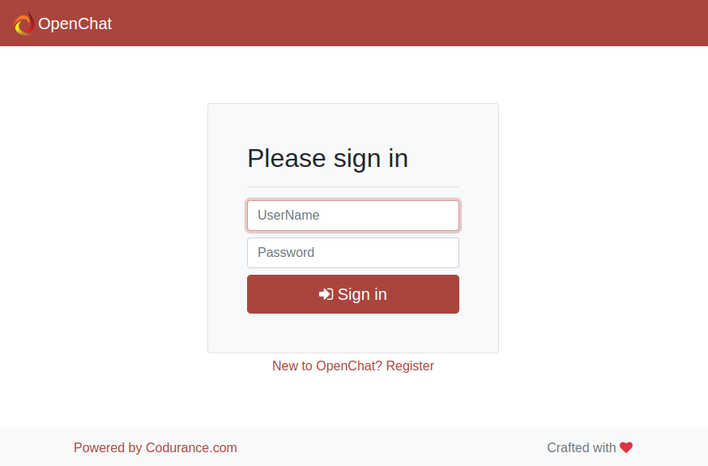
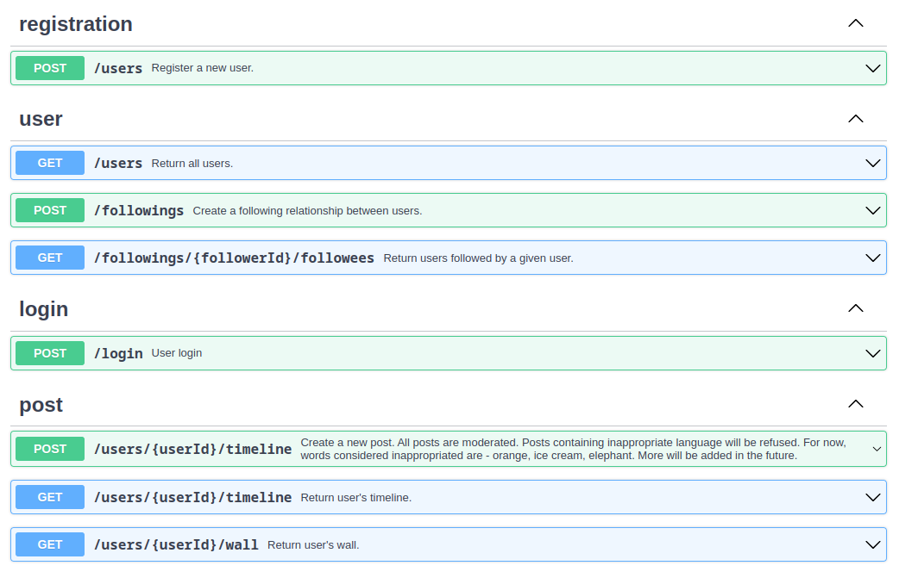

# Open Chat Frontend Kata

Develop a frontend client for the Open Chat project

It consumes API specification in `APIs.yaml`:

-> [browse API specification online](https://editor.swagger.io/?url=https://raw.githubusercontent.com/qmates-tech/openchat-kata-webclient/main/APIs.yaml)

## About this Kata

This is part of a backend + frontend kata, check here the backend part: [qmates-tech/openchat-kata](https://github.com/qmates-tech/openchat-kata)

The original idea of the kata is from Robert C. Martin and Sandro Mancuso in "London vs. Chicago" cleancoders serie:

* [Comparative Case Study // London vs. Chicago - cleancoders.com](https://cleancoders.com/episode/comparativeDesign-episode-1)
* [London vs. Chicago // Introduction - Youtube](https://www.youtube.com/watch?v=v68osKXat90)
* https://github.com/sandromancuso/cleancoders_openchat
* https://github.com/sandromancuso/cleancoders_openchat_webclient
